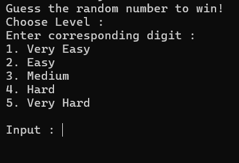
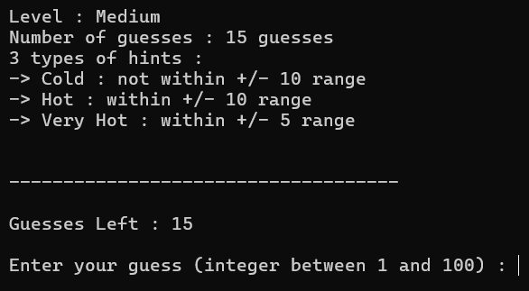
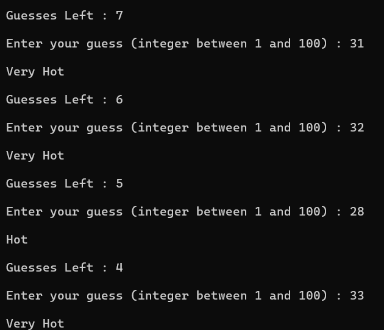
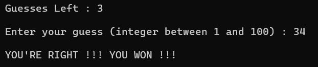

# Guess The Number (C++)

A console-based number guessing game written in C++.

## Features

- Five difficulty levels
- Dynamic hint system
- Random number generation
- Input validation
- Limited guesses based on difficulty

## Difficulty Levels

| Difficulty | Guesses | Available Hints |
|------------|:--------:|-----------------|
| Very Easy  | 25 | Very Cold, Cold, Hot, Very Hot |
| Easy       | 20 | Very Cold, Cold, Hot, Very Hot |
| Medium     | 15 | Cold, Hot, Very Hot |
| Hard       | 10 | Cold, Hot |
| Very Hard  | 5  | Cold, Hot |

## How to Compile

```bash
g++ main.cpp -o game
```

## How to Run

### Linux / macOS

```bash
./game
```

### Windows

```bash
game.exe
```

## Screenshots

### Main Menu



### Rules



### Gameplay



### Winning Screen




## Author

Samyak Chaturvedi || Sam
